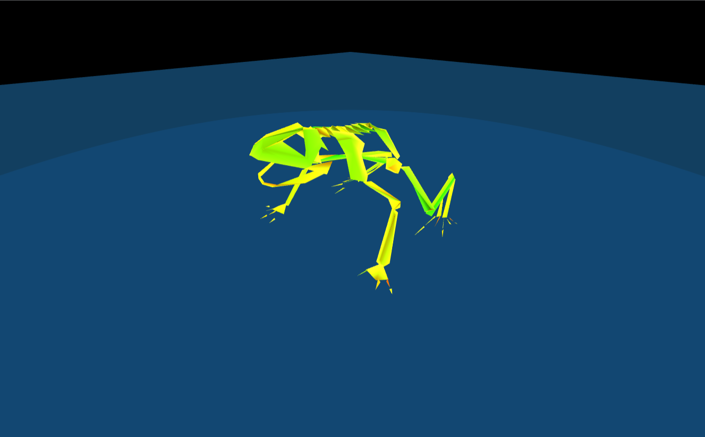

# Three.js Frog Skeleton Animation
This project is a React application that uses Three.js to animate a frog skeleton imported from Blender. The frog skeleton is saved in the glTF format and then animated to perform different actions. The application also utilizes React components and controls for a better user experience.

## Getting Started
To get started with the project, follow the instructions below:

1. Clone the repository
2. Install the dependencies
3. Start the development server

## Project Structure
The project structure is as follows:

* src/ - Contains the main source code of the application.
    * components/ - Contains React components used in the application.
    * style.css - CSS styles for the application.
    * App.js - The main component that renders the Three.js scene and controls.
    * index.js - The entry point of the application.
## Dependencies
The project relies on the following dependencies:

* React - JavaScript library for building user interfaces.
* Three.js - Lightweight 3D library for rendering 3D graphics in the browser.
* GLTFLoader - Three.js loader for loading glTF models.
* OrbitControls - Three.js utility for adding camera controls.
## Features
The application provides the following features:

* Control the frog skeleton's movement using the arrow keys and 'w', 's', 'a', 'd' keys.
* Perform a jump animation by pressing the 'j' key.
* Perform a swimming animation by pressing the 'q' key.
* Control the rotation of the frog's head using the 'a' and 'd' keys.
